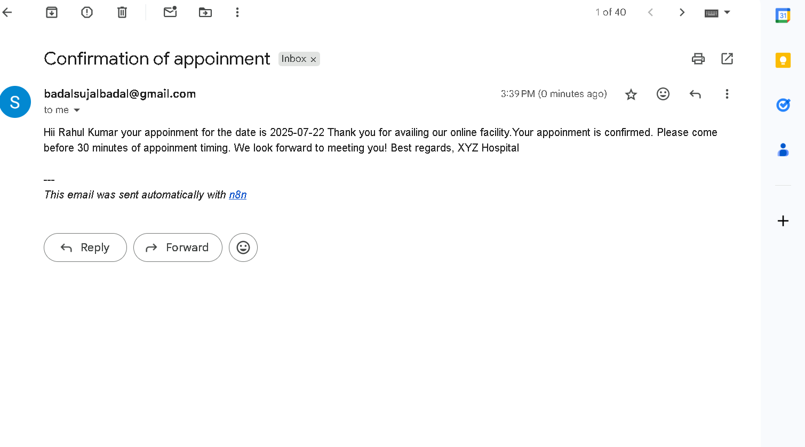
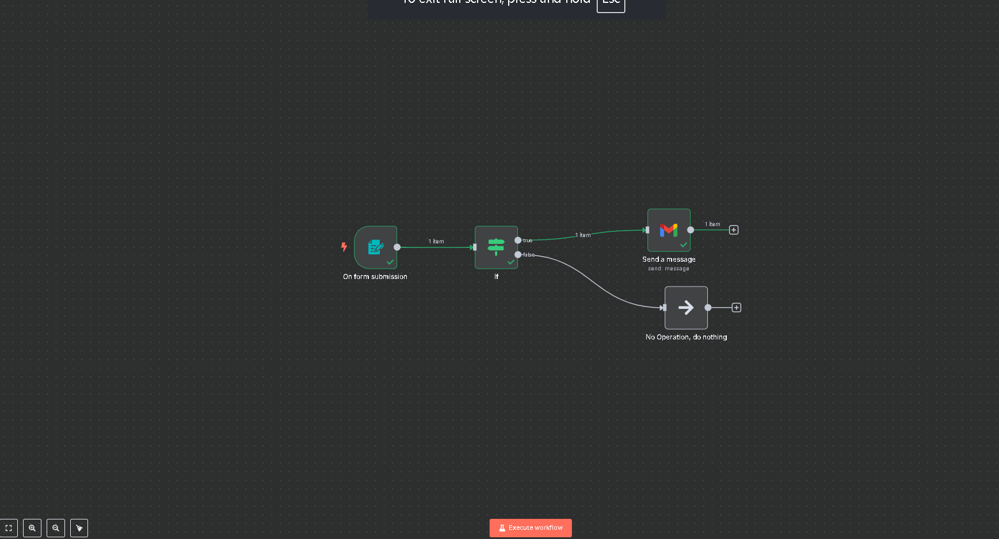

# 📅 Appointment Scheduler using n8n + Gmail

This n8n workflow allows users to submit an appointment form. When a user submits the form:
- The form captures **Email**, **Name**, and **Date**
- It checks if the appointment date is before or equal to a specific date (e.g., 25th July 2025)
- If the condition is met, it sends an appointment confirmation email using Gmail

## ⚙️ Features
- Form Trigger in n8n
- Conditional logic using `If` node
- Gmail integration to send email notifications

## 📥 How to Use

1. Open your n8n instance
2. Click on **Import Workflow**
3. Upload `appointment-scheduler-n8n-workflow.json`
4. Set up your Gmail credentials in the Gmail node
5. Deploy the workflow

## 🛠️ Nodes Used
- **Form Trigger**
- **IF Node**
- **Gmail (send email)**
- **NoOp (fallback if date doesn't match)**

## 📸 Demo Screenshot
 
 

