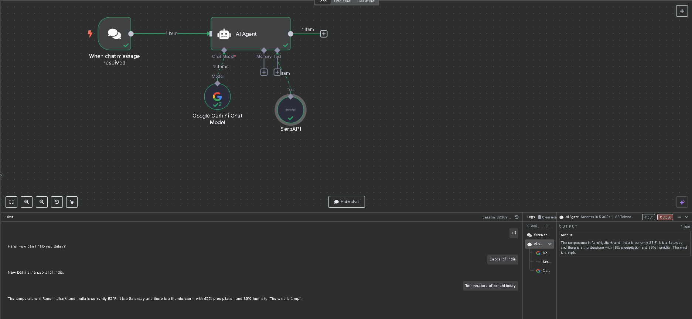

# 🤖 Google Gemini ChatBot with n8n

This project integrates **Google Gemini (PaLM 2.0 Flash)** with **n8n** to create a real-time AI-powered chatbot. It responds intelligently to input using the Gemini large language model — all within a no-code automation workflow.

## 🚀 Features

- 🔄 Real-time AI chat using Gemini API
- 🧠 Powered by Google's Gemini Flash (PaLM 2.0)
- 🔌 Easily pluggable into any n8n flow
- 🛠️ No-code setup via n8n’s visual interface

## 🧰 Tech Stack

- [n8n](https://n8n.io/)
- [Google Gemini (PaLM) API](https://ai.google.dev/)
- LangChain nodes for n8n

## Demo Image

