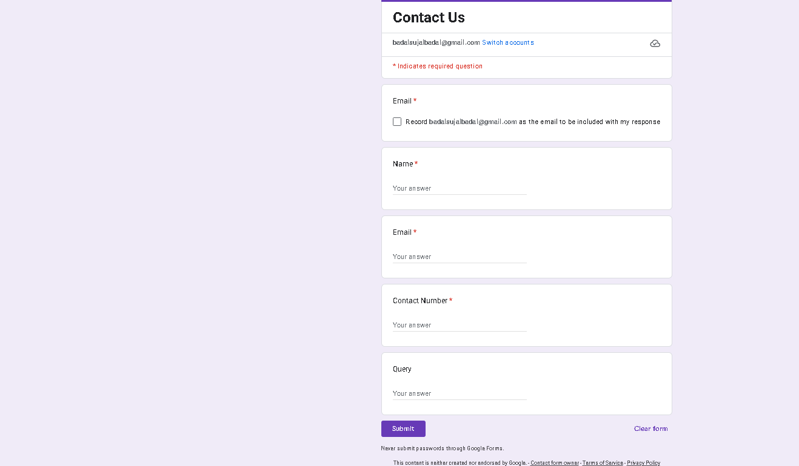
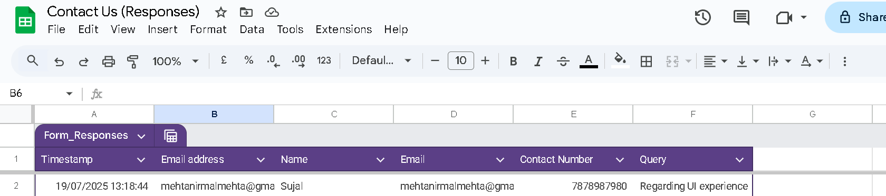
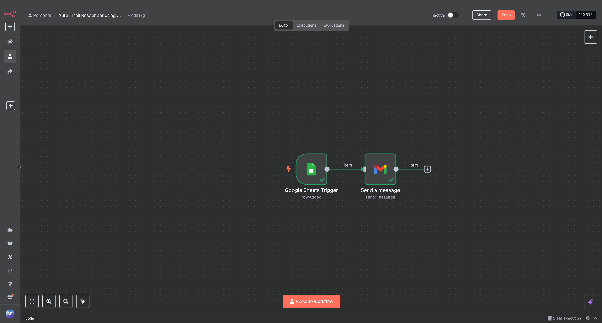

# 🚀 Google Form Auto Email Responder using n8n

A simple automation that sends an automatic email response whenever someone submits a Google Form.

## 🔧 Tech Stack
- Google Forms & Sheets
- n8n (workflow automation)
- Gmail API

## ⚙️ How It Works
1. User fills out a Google Form
2. Responses go to Google Sheets
3. n8n detects new row
4. Gmail node sends a personalized email to the user

## 📁 Files Included
- `workflow.json` – Exported n8n workflow
- `/screenshots` – Images of form, sheet, workflow, and email

## 🧠 Skills Used
- Google API integration
- Automation with n8n
- Real-time triggers
- Email personalization

## 📸 Preview

| Form | Sheet | Workflow | Email |
|------|-------|----------|--------|
|  |  |  |  |

